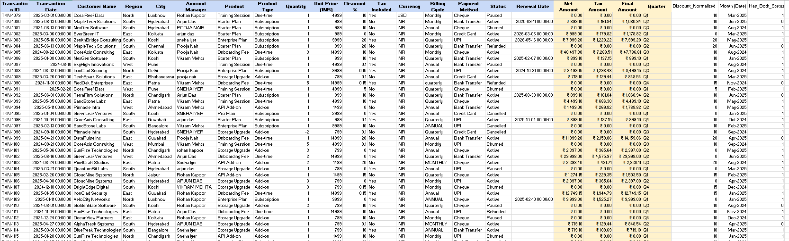
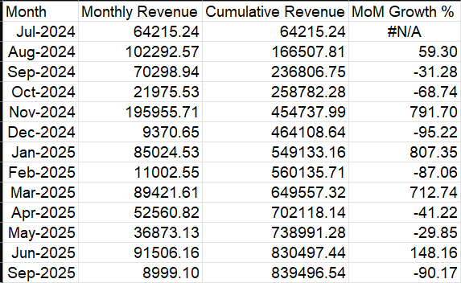
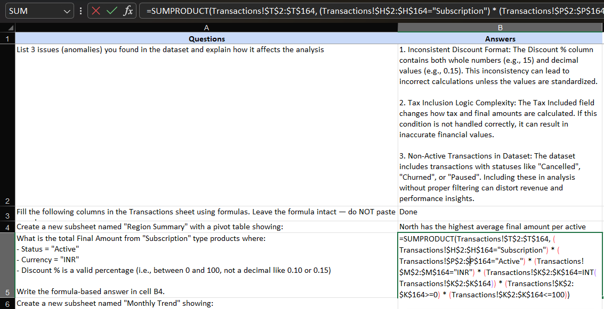

# 📊 Revenue Analysis & Data Cleaning Project

## 🔍 Overview

This project focuses on cleaning, transforming, and analyzing a transactional dataset using Excel/Google Sheets.
The goal was to ensure data quality, apply business logic, and derive meaningful insights.

---

## 🧹 Data Cleaning

One of the key issues identified was inconsistent discount formats.
Some values were stored as whole numbers (e.g., 15) while others were in decimal format (e.g., 0.15).

To standardize:

* Converted all values to a consistent percentage format
* Ensured valid range (0–100)

---

## 📁 Processed Dataset

The dataset was enhanced with calculated columns such as:

* Net Amount
* Tax Amount (based on tax inclusion logic)
* Final Amount
* Normalized Discount
* Month extraction
* Customer status flags

---

## 📊 Analysis

### 1. Region Summary

A pivot table was created to analyze performance across regions.

* North region has the highest average final amount per active transaction

---

### 2. Monthly Trend

A monthly revenue trend was created with:

* Monthly Revenue
* Cumulative Revenue
* Month-over-Month (MoM) Growth

---

## 🧠 Key Formulas & Logic

Advanced formulas were used to apply business conditions:

* Filtered only **Active + Subscription + INR transactions**
* Ensured discount values are valid percentages
* Used `SUMPRODUCT` for multi-condition aggregation
* Used helper columns to identify customers with multiple statuses

---

## ⚠️ Data Quality Issues Identified

1. Inconsistent Discount Format
   Different formats (15 vs 0.15) could lead to incorrect calculations.

2. Tax Inclusion Logic Complexity
   Different handling required depending on whether tax is included.

3. Presence of Non-Active Transactions
   Transactions with statuses like Cancelled/Churned needed filtering to avoid misleading insights.

---

## 📈 Key Insights

* North region shows strongest performance among all regions
* January 2025 recorded the highest revenue
* Customer churn exists alongside active transactions, indicating retention opportunities

---

## 🛠 Tools Used

* Microsoft Excel / Google Sheets
* Pivot Tables
* Advanced Formulas (SUMPRODUCT, IF, COUNTIF, etc.)

---

## 👤 Author

**Sanjay Renukuntla**
