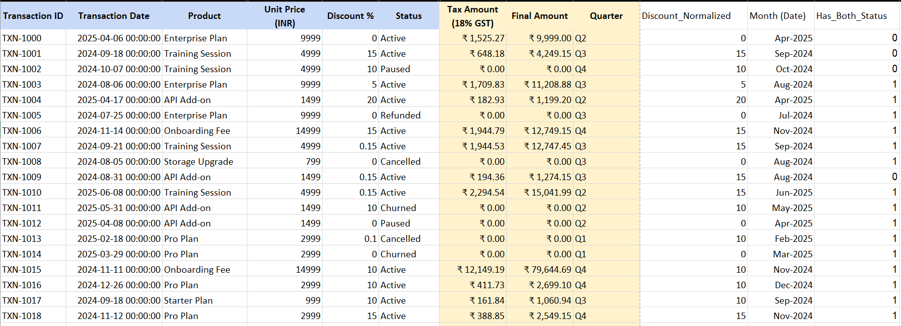
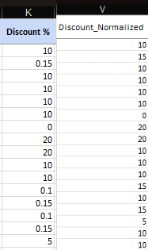
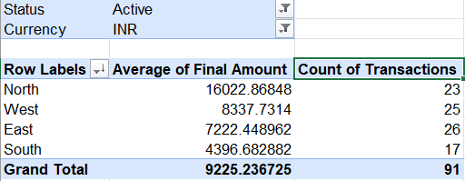

# 📊 Revenue Analysis & Data Cleaning Project (Excel)

An end-to-end Excel-based data analysis project focused on cleaning messy business data, applying conditional logic, and generating actionable insights using formulas and pivot tables.

---

## 📌 Project Overview

This project demonstrates practical data analysis skills using Excel on a transactional dataset containing sales, discounts, tax logic, and customer activity.

Key objectives:
- Clean inconsistent and raw data
- Apply business rules using formulas
- Perform revenue analysis
- Generate insights using pivot tables and trends

---

## 🧹 Data Cleaning & Preparation

Several data quality issues were identified and handled:

- **Inconsistent Discount Format**  
  The discount column contained both whole numbers (e.g., 15) and decimals (e.g., 0.15).  
  → Standardized into a consistent percentage format.

- **Tax Inclusion Logic**  
  Tax calculation varied based on whether tax was already included.  
  → Applied conditional formulas to correctly compute Net and Final amounts.

- **Mixed Transaction Status**  
  Dataset included Active, Cancelled, Churned, and Paused transactions.  
  → Filtered appropriately for accurate analysis.

---

## ⚙️ Key Calculations

The dataset was enhanced using Excel formulas:

- Net Amount  
- Tax Amount (based on tax inclusion logic)  
- Final Amount  
- Discount Normalization  
- Month extraction from date  
- Customer behavior flag (Active + Cancelled/Churned)

---

## 📸 Dataset Snapshot

---

## 🔄 Discount Normalization

Converted inconsistent discount values into a standard format.

---

## 📊 Region-wise Analysis (Pivot Table)

Identified regional performance using pivot tables.

**Insight:**  
North region shows the highest average final amount per active transaction.

---

## 📈 Monthly Revenue Trend

Tracked revenue growth and trends over time.

- Monthly Revenue  
- Cumulative Revenue  
- Month-over-Month Growth %

---

## 📌 Key Insights

- Revenue is highly uneven across regions, with North leading significantly.
- Large fluctuations in monthly growth indicate inconsistent sales performance.
- Data inconsistencies (discount format, tax logic) can significantly impact financial outputs if not handled correctly.
- Customer churn patterns highlight the need for retention strategies.

---

## 🛠 Tools Used

- Microsoft Excel
- Pivot Tables
- Advanced Formulas (IF, SUMPRODUCT, COUNTIF, TEXT, etc.)

---

## 📁 Files Included

- `Revenue_Analysis_Project.xlsx` → Complete working file with formulas
- `/images` → Supporting screenshots for analysis

---

## 📎 Note

The dataset contains multiple attributes (Region, Currency, Status, Product Type, etc.).  
Only relevant columns are shown in focused screenshots for clarity.

---

## 👤 Author

**Sanjay Renukuntla**
